# Summary of MLMT

---

## Table of Contents

- [The Learning Theory](#the-learning-theory)
  - [Hoeffding's Inequality](#Hoeffding's-Inequality)
  - [Union Bound](#union-bound)
  - [Vapnik-Chervonenkis Inequality](#Vapnik-Chervonenkis-Inequality)
- [Machine Learning Algorithm](#machine-learning-algorithm)
  - [KNN](#knn)
  - [Decision Tree](#Decision-Tree)
  - [Random Forest](#Random-Forest)
  - [Linear Classifier](#Linear-Classifier)
  - [SVM](#SVM)
  - [Softmax](#Softmax)
  - [Logistic Regression](#Logistic-Regression)
- [Neural Network](#Neural-Network)
  - [Backpropagation](#backpropagation)
  - [Optimization](#optimization)
  - [Regularization for Deep Learning](#regularization-for-deep-learning)
  - [Activation Function](#activation-function)
  - [Data Preprocessing](#data-preprocessing)
  - [Weight Initialization](#weight-initialization)
  - [Batch Normalization](#batch-normalization)
  - [Babysitting the Learning Process](#babysitting-the-learning-process)
  - [Hyperparameter Searching](#hyperparameter-searching)
- [Convolutional Neural Network](#Convolutional-Neural-Network)
  - [Layers and Structures](#Layers-and-Structures)
  - [LeNet-5](#LeNet-5)
  - [AlexNet](#AlexNet)
  - [ZFNet](#ZFNet)
  - [VGGNet](#VGGNet)
  - [GoogleLeNet](#GoogleLeNet)
  - [ResNet](#ResNet)
- [Recurrent Neural Network](#Recurrent-Neural-Network)
  - [Type and application](#Type-and-application)
  - [Truncated Backpropagation](#Truncated-Backpropagation)
  - [Dealing with Gradient vanishing and exploding](#Dealing-with-Gradient-vanishing-and-exploding)
  - [Long Short Term Memory (LSTM)](#Long-Short-Term-Memory)
- [Reinforcement Learning](#Reinforcement-Learning)
  - [Policy Evaluation](#Policy-Evaluation)
  - [Optimal Policy](#Optimal-Policy)
  - [Q-Learning](#Q-Learning)
  - [Policy Gradient](#Policy-Gradient)
  - [Actor-Critic Algorithm](#Actor-Critic-Algorithm)
- [Dimensionality Reduction](#Dimensionality-Reduction)
  - [SVD](#SVD)
  - [t-SNE](#t-sne)
- [Unsupervised Learning](#Unsupervised-Learning)
  - [Autoencoder](#Autoencoder)
  - [Additive Term to the Reconstruction Error](#Additive-Term-to-the-Reconstruction-Error)
  - [GAN](#GAN)

---

## The Learning Theory

### Essence of Machine Learning

> - A pattern exists.
> - We can not pin it down mathematically.
> - We have data on it.
>

### Learning model = **Hypothesis Set** + **Learning Algorithm**

> A Simple Hypothesis Set (Perceptron)
>
> 
>
> A Simple Learning Algorithm (PLA)
>
> - pick a **misclassified** point: 
> - **update** the weight vector: 

### Hoeffding's Inequality

>\epsilon (tolerance)]\leq 2e^{-2\epsilon^2N} (confidence)" />
>
> The probability of the difference between sample and fact larger than the tolerance is bounded by a confidence upper bound, which dependent of the number of samples.
>
> - the larger sample number, the smaller is the upper bound of probability
> - smaller tolerance need more samples
>
> \epsilon]\leq 2e^{-2\epsilon^2N}" />
>
> - Ein(h): in sample error 
>   - 
> - Eout(h): out of sample error 
>   - 
>
> **If learning is feasible**
> - 

### Union Bound

Hoeffding's Inequality doesn't apply to hypothesis set.

> \epsilon]\leq 2Me^{-2\epsilon^2N}" />
>
> - g (final hypothesis): h1...hm
> - M hypothesis function in hypothesis set

### Vapnik-Chervonenkis Inequality

> Generalization: 
>
> -  (generalizaiton)
> -  (approximation)

- Basis

  > - growth function **mH(N)**: counts the most dichotomies (mini-hypothesis) on any N points
  > - **Breakpoint** of H (If no data set of size k can be shattered by H,then k is a break point for H)
  >   - m_H(N) < 2^k
  >   - no break point -> m_H(N) = 2^N
  >   - any break point -> m_H(N) polynomial in N
  > - Example
  >   - Positive Rays: mH(N) = N+1 (breakpoint k= 2)
  >   - Positive Interval: mH(N) = 1/2*N^2+1/2 *N+1 (breakpoint k= 3)
  >   - Convex Sets: mH(N) = 2^N (breakpoint k= inf)
    
      

- Vapnik-Chervonenkis Inequality
  > - \epsilon]\leq 4m_H(2N)e^{-\frac{1}{8}\epsilon^2N}" />
- VC Dimension (dvc -> model complexity)
  > - the most points H can shatter
  > - N <= dvc(N) <= k (break point)
  > - dvc is finite -> **g in H will generalize**
  > - independent of learning algorithm, input distribution, target function
  > - dvc measures the **effective number of parameters**
- Generalization bound
  > - 
  > - 

Tradeoff
> - complex H -> better approximation (less bias)
> - less complex H -> better generalization (less variance)
  - **Bias** is the difference between the average prediction of our model and the correct value which we are trying to predict. Model with high bias pays very little attention to the training data and oversimplifies the model. It always leads to high error on training and test data.
  - **Variance** is the variability of model prediction for a given data point or a value which tells us spread of our data. Model with high variance pays a lot of attention to training data and does not generalize on the data which it hasn’t seen before. As a result, such models perform very well on training data but has high error rates on test data.

---

## Machine Learning Algorithm

### KNN

> - **train**: Memorize training data
> - **prediction**: Find closest K (hyperparameter: find by **cross validation**) train image and take majority vote from K closest points
>   - calculation of distance could be time consuming
> - **training faster and prediction time comsuming** (bad)
> - Never used for image classification

### Linear Classifier

> - Algebraic Viewpoint: f(x,W) = Wx
> - Visual Viewpoint: figure out one template for each class
> - Geometric Viewpoint: Hyperplanes cutting up space

### SVM

> Hinge loss -> Multiclass SVM loss
> - 
> - optimal W (L=0) is not unique

### Softmax

> Multinomial Logistic Regression 
> interpret raw classifier scores as **probabilities**
>
> - 
> - 
> - score -> exp(score) -> normalize -> probability -> loss = -log(probability)

### Logistic Regression

> 
> 
> - linear classification: h(x) = sign(s)
> - linear regression: h(x) = s
> - logistic regression: h(x) = theta(s)

- logistic function: 
- error measure based on likelihood
  - P(y|x) = h(x) for y = +1
  - P(y|x) = 1-h(x) for y = -1
  - h(x) = &theta;(W'*x)
  - 
  -  
- maximizing the likelihood
  -  
  -  
  - cross entropy:  

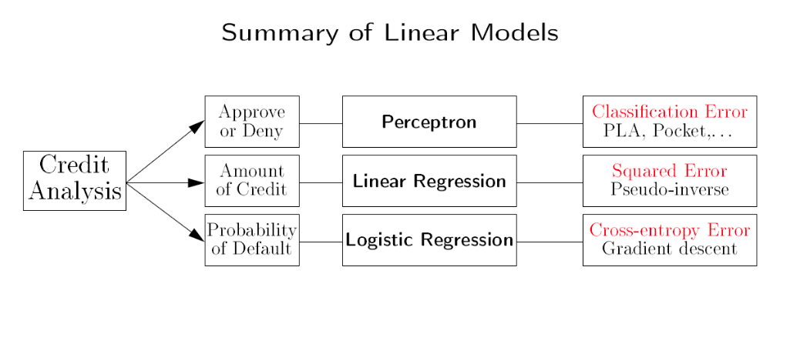

### Regularization

>  
> 
> - L2 Regularization
>   - 
> - L2 Regularization
>   - 
> - Elastic net (L1+L2)
>   - 

- Why?
  - prevent the model from doing too well on training data
  - Make the model simple so it works on test data
  - Improve optimization by adding curvature
  - Express preferences over weights (“spread out” the weights, prefer simple model)

### Decision Tree

> - Entropy
>   - 
> - Expected Entropy (EH)
>   - 
> - Information gain (I)
>   - 
> - Select the attribute: maximize the Information gain -> 

### Random Forest

> - draw bootstrap sample from training data (for random forest tree)
> - decision tree for each random forest tree
> - output the ensemble of trees (trained independently)
> - test time: test point is simultaneously pushed through all trees until it reaches the corresponding leaves.

---

# Neural Network

## Backpropagation

Why do we need Backpropagation?

>Definition: use chain rule along a computational graph recursively to obtain the gradient
>
> Downside: not practical to formulate gradient formula by hand for all parameters of large neural nets

- add gate: gradient distributor
- max gate: gradient router
- mul gate: gradient switcher

### Implementations

- **forward**: compute result of an operation and save any intermediates needed for gradient computation in memory
- **backward**: apply the chain rule to compute the gradient of the loss function with respect to the inputs

---

Price of nonlinear transform?

Looking at the data before choosing the model and be hazardous to your E_out (data snooping)

---
## Optimization

- Numerical gradient: approximate, slow, but easy to write
- Analytic gradient: exact, fast, but error-prone

> In practice: Always use analytic gradient, but check implementation with numerical gradient. This is called a **gradient check**.

## Gradient Descent

Gradient descent is an optimization algorithm, that starts from a random point on the cost function and iteratively travels down its slope in steps until it reaches the lowest cost (local minimum)

step size = gradient * learning rate.

downside: gradient descent is slow on huge data.

## Stochastic Gradient Descent (SGD)

SGD randomly picks one data point from the whole data set at each Gradient Descent iteration to reduce the computations enormously.

### Benefits

- cheaper computation
- randomization
- simple

> It is also common to sample a small number of data points instead of just one point at each step and that is called “mini-batch” gradient descent. Mini-batch tries to strike a balance between the goodness of gradient descent and speed of SGD.

### Problems with SGD

- Loss function has **high condition number** (ratio of largest to smallest singular value of the Hessian matrix is large -> loss changes quickly in one direction and slowly in another)

  > Very slow progress along shallow dimension, jitter along steep direction.

  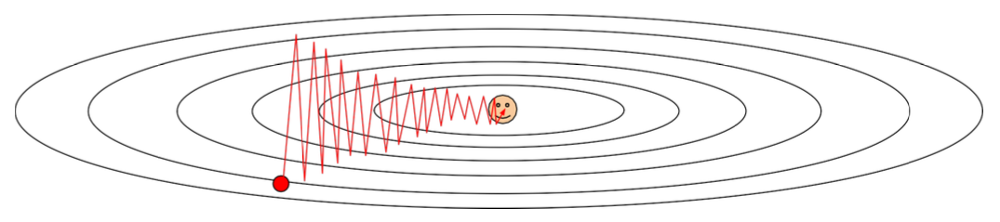

- local minima / saddle point (more common) -> Zero gradient, gradient descent gets stuck

- gradients come from minibatches -> can be noisy

### SGD + Momentum

>The optimization process can then be seen as equivalent to the process of simulating a particle as rolling on the landscape, where the gradient only directly influences the "velocity" and in turn has an effect on the weight (x).

### Nesterov Momentum

> Different version of Momentum. Not evaluate the current gradient but the gradient at the "looked ahead" position.

### AdaGrad

> Scale the gradient based on the accumulated sum of squares of the previous gradient.
>
> - in flat area, the gradient would be large, so that the optimization process would be more efficient in that area. (optimization does not stuck in flat area)
> - in suddenly changed area (large slope), the gradient will be small to prevent from overshoot
> 
> but
> 
> - once we got large slope, the accumulate sum of gradient square would never be small again. (does not work for flat area)

### RMSProp

> So we introduce decay rate in AdaGrad, so that the accumulated gradient square focus on recent gradient square (the influence of large slope would disappear after some steps)

### Adam

> Combine Momentum and AdaGrad/RMSProp
>
> 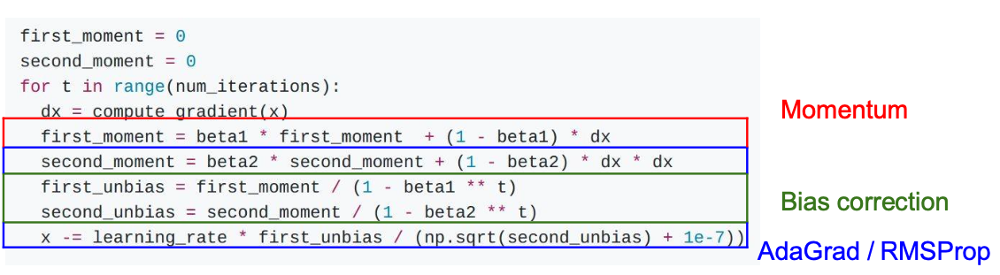
>
> Bias correction for the fact that first and second moment estimates start at zero

---

### Learning Rate Selection

- Step decay (decay learning rate by half every few epoches)
- Exponential decay (&alpha;=&alpha;0e-kt)
- 1/t decay (&alpha;=&alpha;0/(1+kt))

> more critical with SGD+Momentum, less common with Adam

---

### Second-Order Optimization

- Second-order Tayler expansion
  - Pros:
    - no hyperparameters
    - no learning rate
  - cons:
    - computation of the inverse Hessian matrix is not practical.
- **Quasi-Newton methods** (BGFS most popular)
  - instead of inverting the Hessian (O(n^3)), approximate inverse Hessian with rank 1 updates over time (O(n^2) each).
- **L-BGFS** (limited memory)
  - Pros:
    - Does not form/store the full inverse Hessian.
    - Usually works very well in full batch, deterministic mode
  - cons:
    - Does not transfer very well to mini-batch setting

> in practice: **Adam** -> **L-BFGS** (If you can afford to do full batch updates)

---

## Regularization for Deep Learning

> pattern:
>
> Training: add some kind of randomness 
> Test: average out randomness

- Dropout (randomly set some neurons to zero -> p = 0.5 common)
  - force the network to have redundant representation
  - prevent co-adaptation of features
  - training a large ensemble of models
  - **test time: all neurons are active + multiply by dropout probability** (reason: must scale the activations so that the output at the test time matches the expected output at training time, most common divide the probability at training time, so at test time do not need to do anything)

- Data Augmentation
  - translation, rotation, stretching, shearing, lens distortions
  - Training: random crops / scales
  - Test: average a fixed set of crops

- DropConnect
- Fractional Max Pooling
- Stochastic Depth

---

## Transfer Learning

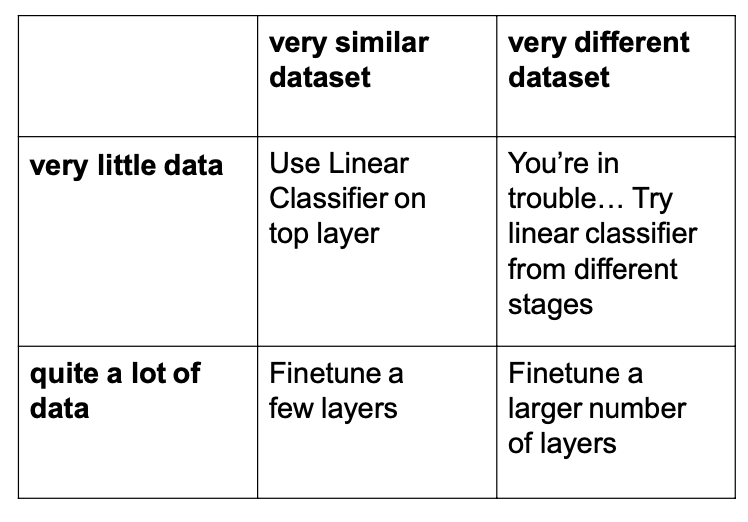

---

## Activation function

### Sigmoid function

> Historically popular since they have nice interpretation as a saturating “firing rate” of a neuron
>
> - Squashes numbers to range [0, 1]
>
> Downsides:
>
> - In saturated area, the gradient is almost 0, which means the model can barely learn (or very slow)
> - Sigmoid outputs are not zero-centered, which limited the direction of gradient update (only all positive or all negative). It would cause zig-zag path if the hypothetical optimal direction is not all positive or all negative
> - Computational inefficiency

### Tanh(x)

> - range [-1, 1]
> - which is zero centered, but still kill the learning process in saturated area

### ReLU

> upsides:
>
> - not saturate
> - computationally efficient
> - converge much faster than Sigmoid and Tanh
> - more biologically plausible than sigmoid
>
> downsides:
>
> - not zero-centered
> - "dead ReLU": never update once the data goes into negative area (initialize ReLU neurons with slightly positive biases)

### Leaky ReLU

> - not saturate
> - computationally efficient
> - converge much faster than Sigmoid and Tanh
> - will not "dead" in negative area

### Exponential Linear Units (ELU)

> - computationally efficient
> - converge much faster than Sigmoid and Tanh
> - will not "dead" in negative area
> - Closer to zero mean outputs
> - Negative saturation regime compared with Leaky ReLU adds some robustness to noise
>
> but
>
> - Computation requires exp()

### Maxout “Neuron”

> 
>
> - non-linear
> - Generalizes ReLU and Leaky ReLU
> - Linear Regime! Does not saturate! Does not die!
>
> but
>
> - doubles the number of parameters

### In practice

- Use **ReLU**. Be careful with your learning rates
- Try out **Leaky ReLU** / **Maxout** / **ELU** / **SELU**
- Try out **tanh** but don’t expect much (in CV)
- **Don’t** use **sigmoid** (Within **inner** Layers of the
network)

---

## Data Preprocessing

- PCA to decorrelated data
- Whitening (for images, remove the ill effects of the internal covariate shift)

In practice:

- not PCA or Whiten
- Substract the mean image
- Substract per-channel mean

---

## Weight Initialization

### Zero Initialization

> As its name suggests, implementing this method sets all the weights to zeros. This method serves almost no purpose as it causes neurons to perform the same calculation in each iterations and produces same outputs.
>
> If all the weights are initialized to zeros, the derivatives will remain same for every w in the layer. As a result, neurons will learn same features in each iterations(fail to break symmetry). And not only zero, any constant initialization will produce a poor result.

### Random Initialization

> It prevents neuron from learning the same features of its inputs. But it has gradient vanishing and gradient exploding problem when the neural network has many layers. (deep)

### Xavier Initialization (for tanh activation)

> The goal of Xavier Initialization is to initialize the weights such that the **variance of the activations** are the same across every layer. This constant variance helps prevent the gradient from exploding or vanishing.
>
> Xavier initialization sets a layer’s weights to values chosen from a random uniform distribution that’s bounded
>
> > W = np.random.randn(fan_in, fan_out) / np.sqrt(fan_in)
>
> work for tanh and sigmoid, **not work for ReLU**

### He initialization (for ReLU)

> W = np.random.randn(fan_in, fan_out) / np.sqrt(fan_in/2)

---

## Batch Normalization

Deep neural network assumes that the output of the prior layer come from the same distribution. But all layers are actually changing during the update (learning) process, so the update procedure is forever chasing a moving target.

Batch Normalization standardizes the activations of the prior layer in every single batch. (Unit gaussian activation)
(**Standardization/Normalizaiton**: rescaling data to have a mean of zero and a standard deviation of one)

> assume the activation function is s-shaped like tanh and sigmoid, usually inserted after fully connected or convolutional layers, before nonlineality. But in practice, after activation works even better for activation function that result non-gaussian distribution output like ReLU.

We need to recover the identity mapping

with

> This step is different at training and test time. Training: calculate mean/std are computed based on batch. Test: fixed empirical mean of activations during training is used (estimate during training with **running averages**)

- less sensitive to initialization method (reduce dependence on initialization)
- make network more stable during training
- can use much larger than normal learning rates -> speed up the learning process
- it is kind of regularization (reduce the need for dropout)

but

- not good with data distribution which is highly non-gaussian

---

## Babysitting the Learning Process

### Learning Rate adjusting

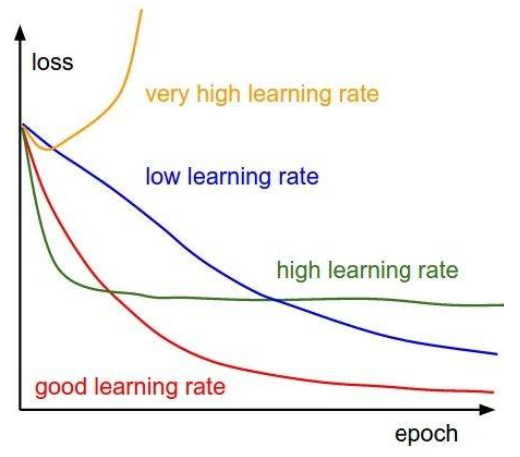

### Check Initialization

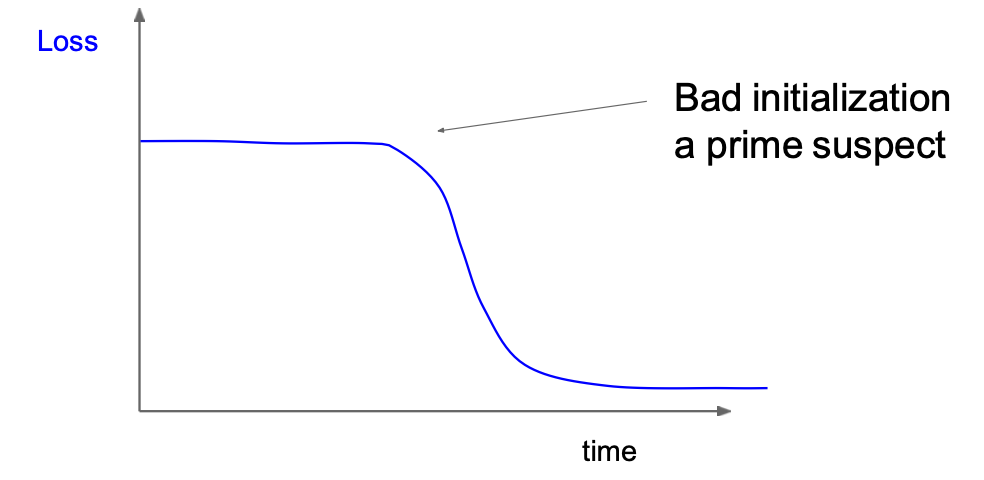

> bad initialization makes loss not decreasing at first than after a while, it would be normal again.

### Check accuracy

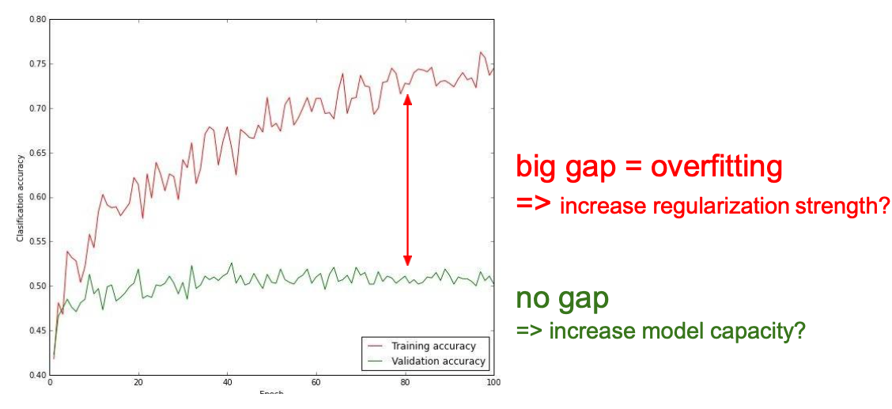

### Check update ratio

> better around 0.001

---

## Hyperparameter Searching

<https://www.sicara.ai/blog/2019-14-07-determine-network-hyper-parameters-with-bayesian-optimization>

### Grid Search

> The easiest way to search for a good combination of hyperparameters is to exhaustively try them all. Basically, it tries out every possible combination of hyperparameters users defined, and select the best combination.
> 
> - easy to implement
> 
> but
> 
> - not practical for deep learning, because this brute-force approach is very computationally > expensive.
> - could still miss global optimum, and waste computational resource to unimportant hyperparameter searching.

### Random Search

> Random search consists in sampling random values in the hyperparameter space.
> 
> - balance the computational cost of grid search
> 
> but
> 
> - inefficient in the way it explores candidate hyperparameters combinations (does not learn from the previous tested combination)
> - method loses efficiency if the impacting parameters are not known beforehand

### Bayesian Optimization

> View hyperparameters tuning as the optimization of a black-box function, objective function is the validation error of a machine learning model using a set of hyperparameters. It constructs a probabilistic representation of the machine learning algorithm’s performance.
>
> In Bayesian optimization, the performance function is modeled as a sample from a Gaussian process (GP) over the hyperparameter value. The posterior distribution for this function allows insight in the confidence of the function’s value in the hyperparameter space. Once the probabilistic model is obtained: either sample near the highest observed value, where performance is likely to increase; or explore another subset of the hyperparameter space, where information is lacking and another maximum could be hiding. (exploitation and exploration trade-off)
>
> > we should choose the next point x where the mean is high (exploitation) and the variance is high (exploration)
>
> - Bayesian optimization takes advantage of previously tested combinations to sample the next one more efficiently.

---

## Convolutional Neural Network

## Layers and Structures

original image -> low-level features -> mid-level features -> high-level features -> linearly separable classifier

### Convolutional Layer

- Output dimension Calculation
  - **Size = (image_dim + 2*padding - filter_dim)/stride + 1**
  > - Filter depth should match the input depth  
  > - (image_dim - filter_dim)/stride not integer -> does not fit
  - **Output dimension = Size * Size * depth(number of filters)**
- Number of parameter calculation
  - **(filter_dim * filter_dim  * filter depth + 1 (bias)) * number of filters**
  > - parameter sharing
  > - do not forget bias term at the end

- Dilated Convolution

  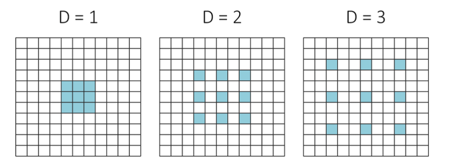

  > Use case: joint rain detection and removal

  - Calculation
    - **Size = (image_dim + 2*padding - filter_dim)/stride + 1**
    - **filter_dim = dilation * (filter_dim-1) + 1**

- effective receptive field
  - **(N-1)_RF = f(N_RF, stride, kernel) = (N_RF - 1) * stride + kernel**

### Pooling Layer

- Meaning: makes the representations smaller and more manageable
- Calculation: **Size = (image_dim + 2*padding - filter_dim)/stride + 1**

> - Parameter: **0**!
> - **preserve the feature depth**

### Fully Connect Layer

- stretch from image to vector
- **dim(W) = dim_out * dim_in**

> - ConvNet: CONV -> POOL -> FC
> - Trend towards **smaller filters** and **deeper architectures**
> - Trend towards getting rid of POOL/FC layers (just CONV)
> - Typical architectures: [[CONV -> ReLU]*N -> POOL] * M -> [FC -> ReLU] * K -> SOFTMAX

---

## LeNet-5

- Conv filters were **5x5**, applied at **stride 1**
- Subsampling (**Pooling**) layers were **2x2** applied at **stride 2**
- Architecture: [CONV-POOL-CONV-POOL-FC-FC]

## AlexNet

- Input: 227x227x3 images
- **first use of ReLU**
- used **Norm layers** (not common anymore) -heavy **data augmentation**
- dropout 0.5
- batch size 128
- SGD Momentum 0.9
- Learning rate 1e-2, reduced by 10 manually when val accuracy plateaus
- L2 weight decay 5e-4
- 7 CNN ensemble: 18.2% -> 15.4% (error)
- Network **spread across 2 GPUs**, half the neurons (feature maps) on each GPU.
- CONV1, CONV2, CONV4, CONV5: Connections **only with feature maps on same GPU**
- CONV3, FC6, FC7, FC8: Connections with all feature maps in preceding layer, communication **across GPUs**

## ZFNet

- AlexNet
- CONV1: change from (11x11 stride 4) to (7x7 stride 2) -> smaller filter
- CONV3,4,5: instead of 384, 384, 256 filters use 512, 1024, 512 -> deeper

## VGGNet

- **Small filters, Deeper networks**
- 8 layers (AlexNet) -> **16 - 19 layers** (VGG16Net)
- **Only 3x3 CONV stride 1, pad 1 and 2x2 MAX POOL stride 2**
- 11.7% top 5 error in ILSVRC’13 (ZFNet) -> **7.3%** top 5 error in ILSVRC’14

> Why use smaller filters? (3x3 conv)
> - Stack of **three** 3x3 conv (stride 1) layers has **same effective receptive field** as one 7x7 conv layer (Three 3x3 conv gives similar representational power as a single 7x7 convolutiona)
> - but deeper, more non-linearities
> - fewer parameters

- ILSVRC’14 2nd in classification, 1st in localization
- Similar training procedure as Krizhevsky 2012
- **No Local Response Normalisation** (LRN)
- Use VGG16 or VGG19 (VGG19 only slightly better, more memory)
- Use **ensembles** for best results
- **FC7 features generalize well to other tasks**

## GoogleLeNet

- **Deeper** networks, with **computational efficiency**
- 22 layers
- Efficient **“Inception”** module (Stack Inception modules with dimension reduction on top of each other)
- **No FC layers** (removed expensive FC layers)
- Only 5 million parameters! **12x less than AlexNet**
- ILSVRC’14 classification winner (**6.7%** top 5 error)
- **Auxiliary classification outputs** to inject additional gradient at **lower layers**

> **“Inception module”**: design a good **local network topology** (network within a network) and then stack these modules on top of each other
> - Apply **parallel filter** operations on the input from previous layer (**multiple size** of CONV layer 1x1 + 3x3 + 5x5 and **pooling operation** 3x3)
> - Concatenate all filter outputs together **depth-wise**
> - dealing with computational complexity -> **"Bottleneck"**
>   - "Bottleneck": use 1x1 convolutions to **reduce feature depth** and preserve spatial dimensions

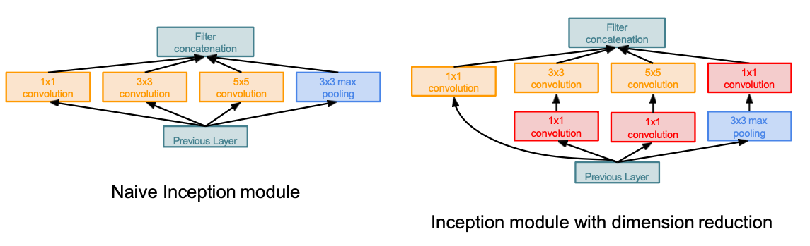

## ResNet

- Very deep networks using **residual connections**
- **152-layer** model for ImageNet
- ILSVRC’15 classification winner (**3.57%** top 5 error, better than human performance)
- Swept all classification and detection competitions in ILSVRC’15 and COCO’15!

> Deeper model performs worse on both training and test error (not caused by overfitting)
> - Hypothesis: the problem is an **optimization** problem, deeper models are **harder to
optimize**
> - Solution: use network layers to fit a **residual mapping** instead of directly trying to fit a desired underlying mapping

Full ResNet architecture:

- Stack residual blocks
  - 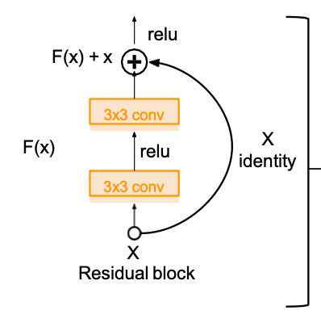
- Every residual block has **two 3x3 conv layers**
- Periodically, **double the number of filters** and **downsample spatially using stride 2** (/2 in each dimension)
- Additional conv layer at the beginning
- **No FC layers** at the end (only FC 1000 to output classes)
- For deeper networks -> use "botleneck" -> improve efficiency
  - 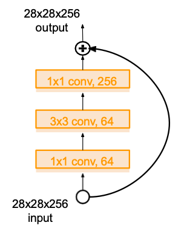

In practice:

- **Batch Normalization** after every CONV layer
- **Xavier/2 initialization from He et al.**
- **SGD + Momentum** (0.9)
- Learning rate: 0.1, divided by 10 when validation error plateaus
- Mini-batch size 256
- Weight decay of 1e-5
- **No dropout** used

## Summary

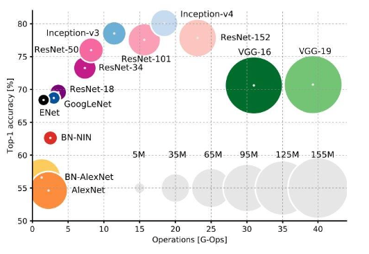

- Inception-v4: Resnet + Inception
- VGG: Highest memory, most operations
- GoogleLeNet: **most efficient**
- AlexNet: smaller compute, still memory heavy, lower accuracy
- ResNet: Moderate efficiency depending on model, **highest accuracy**

More

- Improved ResNet (accuracy)
- Densely Connected Convolutional Networks
- SqueezeNet (efficient)
- Xception Module
- Temporal Convolutional Networks (TCN)

---

## Recurrent Neural Network

> - ht: new state
> - ht-1: old state
> - xt: timestep input
>
> **The same function and the same set of parameters are used at every time step!**

## Type and application

- one to many (decode vector to sequence) : Image Captioning (image -> Sequence of words)
- many to one (Encode input sequence in a single vector): Sentiment Classification (Sequence of words -> Sentiment)
- many to many (shifted): Machine Translation (sequence of words -> sequence of words)
- many to many (no shift): Video Classification on frame level

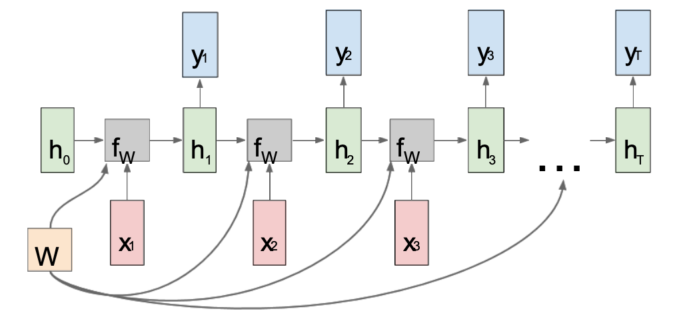

## Truncated Backpropagation

- Run forward and backward through **chunks** of the sequence instead of whole sequence
- Carry hidden states forward in time forever, **but only backpropagate for some smaller number of steps**

## Dealing with Gradient vanishing and exploding

- Largest singular value > 1: Exploding gradients -> **gradient clipping** (Scale gradient if its norm is too big)
  > grad *= (threshold / grad_norm)
- Largest singular value < 1: Vanishing gradients -> **change RNN architechture (LSTM)**

## Long Short Term Memory

- f: Forget gate, Whether to erase cell , whether to write to cell (controls what information in the cell state to forget, given new information than entered the network.)
- i: Input gate (controls what new information will be encoded into the cell state, given the new input information.)
- g: Gate gate, How much to write to cell
- o: Output gate, How much to reveal cell (controls what information encoded in the cell state is sent to the network as input in the following time step)

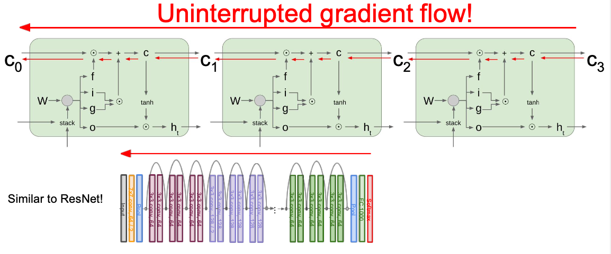

- How come vanishing gradient?
  > However, RNNs suffer from the problem of vanishing gradients, which hampers learning of long data sequences. The gradients carry information used in the RNN parameter update and when the gradient becomes smaller and smaller, the parameter updates become insignificant which means no real learning is done.
- How LSTM solve this?
  > Notice that the gradient contains **the forget gate’s vector of activations**, which allows the network to **better control the gradients values**, at each time step, using suitable parameter updates of the forget gate. The presence of the forget gate’s activations allows the LSTM to decide, at each time step, that certain information should not be forgotten and to update the model’s parameters accordingly.

## Summary

> - RNNs allow a lot of **flexibility in architecture design**
> - Vanilla RNNs are simple but don’t work very well
> - Common to use **LSTM** or **GRU**: their additive interactions improve gradient flow
> - Backward flow of gradients in RNN can **explode or vanish**. Exploding is controlled with **gradient clipping**. Vanishing is controlled with **additive interactions (LSTM)**
> - **Attention can help to efficiently set the context in sequential Models**

---

## Reinforcement Learning

> Problems involving an **agent** interacting with an **environment**, which provides numeric **reward** signals
>
> **Goal**: Learn **how to take actions** in order to **maximize reward**

### Mathematical Formulation of RL

- Markov Decision Process (Discrete time stochastic control process)
  - **Markovproperty**: Current state can completely describe the state of the world

> - **S**: set of possible states
> - **A**: set of possible actions
> - **R**: distribution of **reward** given (state, action) pair
> - **P**: transition probability i.e. distribution over next state given (state, action) pair
> - &gamma;: discount factor

### How to handle the randomness

> Maximize the expected sum of rewards!

### Policy Evaluation

- The **Value function** at state s, is the expected cumulative reward from following the policy from state s (how good is a state)
- The **Q-value function** at state s and action a, is the expected cumulative reward from taking action a in state s and then following the policy (how good is a state-action pair)

### Optimal Policy

**Value iteration algorithm**: Use **Bellman equation** as an iterative update

Bellman equation: 

> If the optimal state-action values for the next time-step Q*(s’,a’) are known,
then the optimal strategy is to take the action that maximizes the **expected value** of r + &gamma;Q *(s',a')
>
> The optimal policy u* corresponds to taking the best action in any state as specified by Q *

Cons:

- Not scalable
- Must compute Q(s,a) for every state-action pair
- Computationally infeasible to compute for entire state space

Solution: use a function approximator to estimate Q(s,a) (Neural Network)

### Q-Learning

Use a **function approximator** to estimate the action-value function (**Deep Q-Learning** (If the function approximator is a neural )network) -> Q(s,a;&theta;) approximate Q*(s,a)

> - does not always work but when it works, usually more sample-efficient. **Challenge: exploration** 
> - **No guarantees** since you are approximating Bellman equation with a complicated function approximator

- Problem:

  > - Samples are **correlated** => inefficient learning
  > - Current Q-network parameters determines next training samples (e.g. if maximizing action is to move left, training samples will be dominated by samples from left-hand size) => can lead to bad feedback loops

- Solution:
  > **experience replay**
  >
  > - Continually update a **replay memory table** of transitions (st, at, rt, st+1) as game (experience) episodes are played
  > - Train Q-network on **random minibatches** of transitions from the **replay memory**, instead of consecutive samples
  > - Each transition can also contribute to multiple weight updates => **greater data efficiency**

- Algorithm

### Policy Gradient

> - very general but suffer from high variance so requires a lot of samples. **Challenge: sample-efficiency**
> - Converges to a local minima of J(θ), often **good enough**!

- Motivation

  > - The Q-function can be very complicated (high-dimensional state/action space -> hard to learn state-action pair)
  > - Finding the best policy in collection of policies can be much simpler

- REINFORCE algorithm
  
  > - If r(τ) is high, push up the probabilities of the actions seen
  > - If r(τ) is low, push down the probabilities of the actions seen
  > - Con: suffers from **high variance** because credit assignment is really hard

- Variance Reduction

  > - Push up probabilities of an action seen, only by the cumulative future reward from that state
  > - Discount factor (ignore delayed effects)
  > - **Baseline** (The raw value of a trajectory isn’t necessarily meaningful. For example, if rewards are all positive, you keep pushing up probabilities of actions)
  >   - constant **moving average** of rewards experienced so far from all trajectories
  >   - **Advantage Function**: A = Q&pi;(st, at) - V&pi;(st) (how much an action was better than expected) -> push up the probability of an action from a state, if this action was better than the expected value of what we should get from that state.

### Actor-Critic Algorithm

> **Actor** (Policy Gradient -> policy) + **Critic** (Q-Learning -> Q-function)
>
> - The **actor** decides which action to take, and the **critic** tells the actor how good its action was and how it should adjust.
> - experience replay
> - advantage function

- Recurrent Attention Model (RAM)

---

## Dimensionality Reduction

> Goal of dimensionality reduction is to **discover the axis of data**!

### SVD

> **A = U&Sigma;VT** (unique)
>
> - U: user-to-concept factors
> - V: movie-to-concept factors
> - &Sigma; : strength of each concept
> - U, V are orthonormal (UUT=I)
> - &Sigma; is diagonal

Relation to Eigen-decomposition
>
> - AAT = U&Sigma;&Sigma;TUT = X&Sigma;&Sigma;TXT
> - ATA = V&Sigma;&Sigma;TVT
>

Computation of SVD (1)

> - Finding **principle eigenvalue** (largest one) and coresponding **eigenvector**
>   - Start with any “guess eigenvector” x0
>   - Construct xk+1 = Mxk / ||Mxk|| (Frobenius norm)
>   - Stop when consecutive xk show little change
>   - principle eigenvalue: &lambda; = xTMx
> - Eliminate the portion of the matrix M that can be generated by the first eigen pair
>   - M* := M - &lambda;xxT
> - Recursively find the principal eigenpair for M*, eliminate the effect of that pair, and so on

Computation of SVD (2)

> - (ATA)V = V&Sigma;2
>   - i-th column of V is an eigenvector of ATA
>   - i-th element of &Sigma;2 is eigen value
> - finding the eigenpairs for ATA
> - Symmetric argument, ATA gives us U

How to reduce dimensionality?
> Set smallest singular values to zero

How to decide the remaining dimensionality?
> Pick r so the retained singular values have at least **90%** of the total energy. (remember to square)

Pros & Cons:

> - Optimal low-rank approximation (+)
> - Interpretability problem: A singular vector specifies a linear combination of all input columns or rows (-)
> - Lack of sparsity: Singular vectors are dense! (-)

### t-SNE (t distributed Stochastic Neighborhood Embedding)

t-SNE tends to **preserve local structure** at the same time **preserving the global structure** as much as possible. What t-SNE does is find a way to project data into a low dimensional space so that the clustering in the high dimensional space is preserved.

Drawbacks of SNE

> - Cost function is difficult to optimize
> - Crowding problem

Novel features in t-SNE

> - Cost function is symmetrized version of that in SNE
> - Student t-distribution is used to compute the similarities between data points in the low dimensionalspace

---

## Unsupervised Learning

### Autoencoder

It is then trained by using as target data the same images as the input images, meaning that the autoencoder learns to reconstruct the original inputs.

Why dimensionality reduction?
> Want features to **capture meaningful factors of variation** in data

How to learn this feature representation?
> Train such that features can be used to reconstruct original data

Different type

> - Denoised Autoencoders (bottleneck in the middle)
> - Sparse Autoencoders
> - Contractive Autoencoders (Additive Term to the Reconstruction Error)
> - Variational Autoencoders

### Additive Term to the Reconstruction Error

Instead of fixed code, VAE learn mean and variance from images in the latent space (encoder network), assume images were generated by statistical process. use mean and variance to randomly sample element from distribution and decode that into image (decoder network).

- The stochasticity of this process improves robustness
- forces the latent space to encode meaningful representations everywhere

> First, an encoder module turns the input samples `input_img` into two parameters in a latent space of representations, which we will note `z_mean` and `z_log_variance`.
> 
> Then, we randomly sample a point `z` from the latent normal distribution that is assumed to generate the input image, via `z = z_mean + exp(z_log_variance) * epsilon`, where `epsilon` is a random tensor of small values.
> 
> Finally, a decoder module will map this point in the latent space back to the original input image. Because `epsilon` is random, the process ensures that every point that is close to the latent location where we encoded `input_img` (`z-mean`) can be decoded to something similar to `input_img`, thus forcing the latent space to be continuously meaningful. Any two close points in the latent space will decode to highly similar images.
> 
> Continuity, combined with the low dimensionality of the latent space, forces every direction in the latent space to encode a meaningful axis of variation of the data, making the latent space very structured and thus, highly suitable to manipulation via concept vectors.
> 
> The parameters of a VAE are trained via two loss functions:
> - A reconstruction loss that forces the decoded samples to match the initial inputs
> - A regularization loss, which helps in learning well-formed latent spaces and reducing overfitting to the training data.

### GAN

- give up on explicitly modeling density -> ability to sample
- learn to generate from training distribution through 2-player game

- structure:

  > - Generator network: try to fool the discriminator by generating real-looking images 
  > - Discriminator network: try to distinguish between real and fake images
  > - minmax game
  >   - Discriminator (θd) wants to maximize objective such that D(x) is close to 1 (real) and D(G(z)) is close to 0 (fake)
  >   - Generator (θg) wants to minimize objective such that D(G(z)) is close to 1 (discriminator is fooled into thinking generated G(z) is real)

- Pros: 
  - Beautiful, state-of-the-art samples!
- Cons:
  - Trickier / more unstable to train
  - Can’t solve inference queries such as p(x), p(z|x) (no inference queries)